# Cascode Gain Stage
Christian Enz (christian.enz@epfl.ch)
2025-05-13

-   [1
    Introduction](#introduction)
-   [2 Analysis](#analysis)
    -   [2.1 Small-signal
        analysis](#small-signal-analysis)
    -   [2.2 Noise
        analysis](#noise-analysis)
-   [3 Design](#design)
    -   [3.1 Circuit](#circuit)
    -   [3.2
        Specifications](#specifications)
    -   [3.3 Process](#process)
    -   [3.4 Design
        procedure](#design-procedure)
        -   [3.4.1 Sizing of
            M1](#sizing-of-m1)
        -   [3.4.2 Sizing the
            bias circuit](#sizing-the-bias-circuit)
        -   [3.4.3 Sizing of
            M2](#sizing-of-m2)
    -   [3.5 Summary](#summary)
        -   [3.5.1
            Specifications](#specifications-1)
        -   [3.5.2 Bias](#bias)
        -   [3.5.3 Transistor
            information](#transistor-information)
-   [4 Theoretical
    estimations](#theoretical-estimations)
    -   [4.1 Transfer
        function](#transfer-function)
    -   [4.2 Input-referred
        noise](#input-referred-noise)
-   [5 Validation by
    simulation](#validation-by-simulation)
    -   [5.1 Operating
        point](#operating-point)
    -   [5.2 Small-signal
        transfer function](#small-signal-transfer-function)
    -   [5.3 Output
        resistance](#output-resistance)
    -   [5.4 Input-referred
        noise](#input-referred-noise-1)
-   [6 Conclusion](#conclusion)
-   [7 References](#references)

# Introduction

This notebook presents the design of a cascode gain stage using the sEKV
model and the inversion coefficient approach \[1\], \[2\], \[3\].

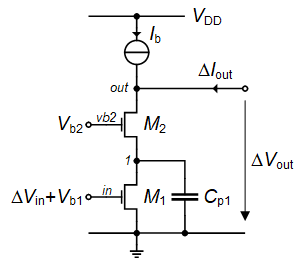

The schematic of the cascode gain stage is shown in
<a href="#fig-cascode_schematic" class="quarto-xref">Figure 1</a>. Let’s
start with the small-signal analysis.

# Analysis

## Small-signal analysis

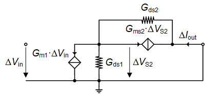

> **Note**
>
> In the following analysis, the current source will be considered as
> ideal, i.e. zero output conductance. Of course, this current source is
> implemented by one or several transistors. In order not to degrade the
> overall output conductance and the DC gain, the current source should
> have an output conductance smaller than the cascode gain stage. This
> means that the current source should also be cascoded.

The small-signal schematic corresponding to
<a href="#fig-cascode_schematic" class="quarto-xref">Figure 1</a> for
the derivation of the equivalent transconductance is given in
<a href="#fig-cascode_gm" class="quarto-xref">Figure 2</a>. Note that
the output is short-circuited for calculating the short-circuit output
current and the corresponding transconductance. The equivalent
transconductance is given by which shows that assuming
*G**m**s*2 ≫ *G**d**s*1, *G**d**s*2,
the equivalent transconductance of the cascode stage is equal to the
transconductance of the driver transistor M1. This result is
expected since the cascode transistor is a common gate stage which has a
unity current gain so that the current coming from the driver transistor
M1 is directly directed to the output.

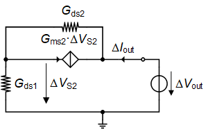

The small-signal schematic for the calculation of the output conductance
is shown in
<a href="#fig-cascode_gout" class="quarto-xref">Figure 16</a>. The
output conductance is given by which is equal to the output conductance
of M1, *G**d**s*1, divided by the voltage gain of
the cascode *G**m**s*2/*G**d**s*2. This means
that, at low-frequency, the output conductance of a single transistor
can be reduced by adding a cascode stage at the cost of some voltage
headroom to maintain M2 in saturation.

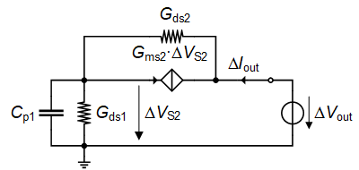

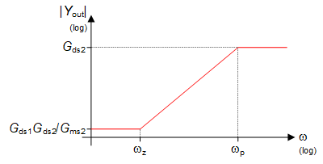

The impact of the parasitic capacitance at node 1 on the output
conductance can be investigated by adding the capacitance as shown in
<a href="#fig-cascode_gout_cp1" class="quarto-xref">Figure 4</a>. The
output admittance then becomes where

The magnitude of *Y**o**u**t* versus frequency is sketched in
<a href="#fig-cascode_yout" class="quarto-xref">Figure 5</a>. For
*ω* ≪ *ω**z* ≪ *ω**p*,
*Y**o**u**t* ≅ *G**o**u**t*. However for
*ω**z* ≪ *ω**p* ≪ *ω*, the output admittance
becomes *Y**o**u**t* ≅ *G**d**s*2. We see that the
cascode effect is lost. This can easily be understood since for
*ω**p* ≪ *ω*, the cascode node 1 is shortened to the ac
ground and the voltage controlling the source of M2 is zero
leaving the output conductance of M2 only.

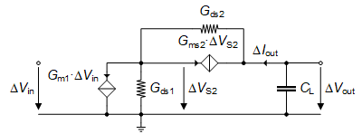

The transfer function can be calculated using the schematic shown in
<a href="#fig-cascode_av" class="quarto-xref">Figure 6</a> resulting in
with .

The gain-bandwidth product is then given by which, as expected, is equal
to the ratio of the cascode equivalent transconductance
*G**m*1 to the load capacitance *C**L*.

## Noise analysis

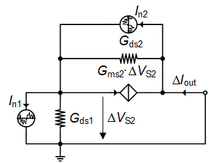

To calculate the output noise power spectral density (PSD) we can use
the schematic shown in
<a href="#fig-cascode_noise" class="quarto-xref">Figure 7</a>. The
output noise current is then given by for
*G**m**s*2 ≫ *G**d**s*1, *G**d**s*2. We
see that the contribution to the output noise current of the cascode
stage is actually divided by
*G**m**s*2/*G**d**s*1. Provided that this gain can
be made sufficiently large and that both transistor have the same noise,
the noise of the cascode stage can be made negligible compared to the
noise due to M1. Ultimately if *G**d**s*1 = 0, the
noise current *I**n*2 circulates in the cascode transistor
M2 (*G**m**s*2 in the small-signal schematic) and
hence does not reach the output.

The output noise conductance is then given by where the noise
conductances are given by

The input-referred noise is obtained by dividing
*G**n**o**u**t* by *G**m**e**q*2,
resulting in It can be decomposed into the thermal and flicker noise
components according to where *R**n**t* is the total
input-referred thermal noise where represents the contribution to the
input-referred thermal noise of the cascode transistor M2
relative to that of the driver transistor M1. Since for
long-channel transistors *γ**n*1 and *δ**n*2 are
of the same order of magnitude and since
*G**m*1*G**m**s*2 ≫ *G**d**s*12
then *η**t**h* ≪ 1. This means that the contribution of the
cascode transistor to the input-referred thermal noise is negligible.

*R**n**f*(*f*) is the input-referred 1/f noise where
represents the contribution to the input-referred flicker noise of the
cascode transistor M2 relative to the driver transistor
M1. If M1 and M2 have about the same
area, then *η**f**l* ≪ 1, meaning that the contribution of
the cascode transistor to the input-referred flicker noise is
negligible.

The *γ**n* noise factor of the cascode stage is given by
since
*G**m*1*G**m**s*2 ≫ *G**d**s*12.
The contribution of the cascode transistor to the overall noise excess
factor is therefore negligible. The same remark holds for the 1/f noise.
Indeed, assuming M1 and M2 have the same area and
*G**m*1/*G**d**s*1 ≫ 1, simplifies to which
corresponds to the contribution of M1 only.

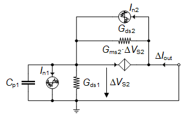

Similarly, the impact of the parasitic capacitance on the noise can be
calculated from
<a href="#fig-cascode_noise_cp1" class="quarto-xref">Figure 8</a>. The
output noise conductance is then given by where

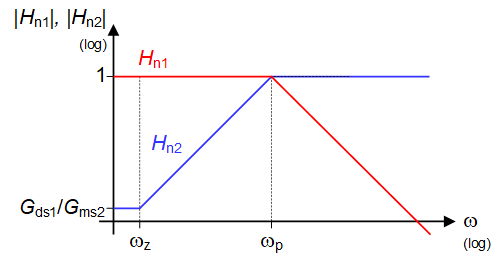

The magnitude of *H**n*1 and *H**n*2 versus
frequency are sketched in
<a href="#fig-cascode_hn1_hn2" class="quarto-xref">Figure 9</a>. For
*ω* ≪ *ω**z* ≪ *ω**p*, *H**n*1 ≅ 1 and
*H**n*2 ≅ *G**d**s*1/*G**m**s*2 which
is the result obtained above. However, for
*ω**z* ≪ *ω**p* ≪ *ω*,
*H**n*1 ≅ *ω**p*/*s* and *H**n*2 ≅ 1.
We see that the cascode effect is lost since the noise of M2
is no more divided by the cascode gain
*G**m**s*2/*G**d**s*1 but is entirely transferred
to the output.

As a conclusion, adding a cascode stage reduces the output conductance
without penalty on the noise, but at the cost of a slight voltage
overhead for maintaining M2 in saturation. This is only true
for *ω* \< *ω**z* = *G**d**s*1/*C**p*1.
For frequencies
*ω* ≫ *ω**p* = *G**m**s*2/*C**p*1 the
cascode effect is lost. Note that in order to maximize
*G**m**s*2 at a given current and minimize its saturation
voltage, M2 should be biased in weak inversion.

We now will use the above equations to design the cascode gain stage.

# Design

## Circuit

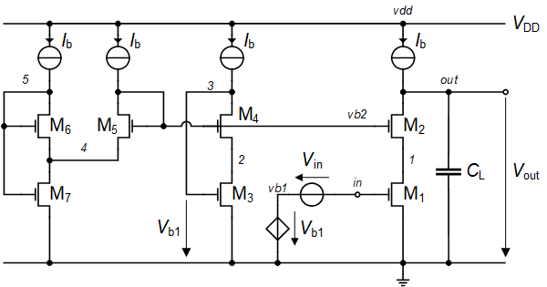

The schematic of the cascode gain stage is shown in
<a href="#fig-cascode_with_bias" class="quarto-xref">Figure 10</a>. We
have included the bias circuit made of transistors M3 to
M7. Transistors M3 and M4 are added to
correctly set the gate bias voltage of M1 for the the bias
current *I**b* for the simulation. M3 and
M4 are made identical to M1 and M2,
respectively. They are sharing the same cascode bias voltage
*V**b*2 generated by transistors M5, M6
and M7. Assuming that transistors M5,
M6 and M7 are all biased in weak inversion, it can
be shown that the drain voltage *V**D*1 (voltage at node 1),
is given by where The bias voltage *V**D*1 should be at least
4 *U**T*. If we make M5 identical to M2
and M4, then *β*2/*β*5 = 1. To get
*V**D*1 = 4 *U**T* would require
*β*6/*β*7 ≅ 54 which is prohibitive. We therefore
need to take advantage of the additional degree of freedom choosing
*β*2 \> *β*5. For example if we take
*β*2/*β*5 = *β*6/*β*7 = 5 we
get *V**D*1 ≅ 4 *U**T*.

## Specifications

We will design the cascode gain stage for the specifications given in
<a href="#tbl-specs" class="quarto-xref">Table 1</a>, namely a given
gain-bandwidth product *G**B**W* and DC gain *A**d**c*. Note
that, contrary to the common-source optimization, in this design,
increasing the width of M1 does not increase the load
capacitance but increases the parasitic capacitance *C**p*1
at the cascode node.

<table class="do-not-create-environment cell">
<thead>
<tr>
<th style="text-align: left;">Specification</th>
<th style="text-align: center;">Symbol</th>
<th style="text-align: center;">Value</th>
<th style="text-align: center;">Unit</th>
</tr>
</thead>
<tbody>
<tr>
<td style="text-align: left;">Minimum DC gain</td>
<td style="text-align: center;"><em>A</em><em>d</em><em>c</em></td>
<td style="text-align: center;">100</td>
<td style="text-align: center;">-</td>
</tr>
<tr>
<td style="text-align: left;">Minimum DC gain</td>
<td style="text-align: center;"><em>A</em><em>d</em><em>c</em></td>
<td style="text-align: center;">40</td>
<td style="text-align: center;"><em>d</em><em>B</em></td>
</tr>
<tr>
<td style="text-align: left;">Minimum gain-bandwidth product</td>
<td style="text-align: center;"><em>G</em><em>B</em><em>W</em></td>
<td style="text-align: center;">1</td>
<td style="text-align: center;"><em>M</em><em>H</em><em>z</em></td>
</tr>
<tr>
<td style="text-align: left;">Load capacitance</td>
<td style="text-align: center;"><em>C</em><em>L</em></td>
<td style="text-align: center;">1</td>
<td style="text-align: center;"><em>p</em><em>F</em></td>
</tr>
</tbody>
</table>

## Process

We will design the cascode gain stage for the open source IHP 13G2
BiCMOS process \[4\]. The physical parameters are given in
<a href="#tbl-physics_param" class="quarto-xref">Table 2</a>, the global
process parameters in
<a href="#tbl-process_param" class="quarto-xref">Table 3</a> and finally
the MOSFET parameters in
<a href="#tbl-mos_param" class="quarto-xref">Table 4</a>.

> **Warning**
>
> The matching parameters for IHP 130nm are unknown. We will use those
> from a generic 180nm technology.

<table class="do-not-create-environment cell">
<thead>
<tr>
<th style="text-align: center;">Parameter</th>
<th style="text-align: center;">Value</th>
<th style="text-align: center;">Unit</th>
</tr>
</thead>
<tbody>
<tr>
<td style="text-align: center;"><em>T</em></td>
<td style="text-align: center;">300</td>
<td style="text-align: center;"><em>K</em></td>
</tr>
<tr>
<td style="text-align: center;"><em>U</em><em>T</em></td>
<td style="text-align: center;">25.865</td>
<td style="text-align: center;"><em>m</em><em>V</em></td>
</tr>
</tbody>
</table>

<table class="do-not-create-environment cell">
<thead>
<tr>
<th style="text-align: center;">Parameter</th>
<th style="text-align: center;">Value</th>
<th style="text-align: center;">Unit</th>
<th style="text-align: left;">Comment</th>
</tr>
</thead>
<tbody>
<tr>
<td style="text-align: center;"><em>t</em><em>o</em><em>x</em></td>
<td style="text-align: center;">2.24</td>
<td style="text-align: center;"><em>n</em><em>m</em></td>
<td style="text-align: left;">SiO2 oxyde thickness</td>
</tr>
<tr>
<td style="text-align: center;"><em>C</em><em>o</em><em>x</em></td>
<td style="text-align: center;">15.413</td>
<td style="text-align: center;">$\frac{{fF}}{{\mu m^2}}$</td>
<td style="text-align: left;">Oxyde capacitance per unit area</td>
</tr>
<tr>
<td style="text-align: center;"><em>V</em><em>D</em><em>D</em></td>
<td style="text-align: center;">1.2</td>
<td style="text-align: center;"><em>V</em></td>
<td style="text-align: left;">Nominal supply voltage</td>
</tr>
<tr>
<td style="text-align: center;"><em>L</em><em>m</em><em>i</em><em>n</em></td>
<td style="text-align: center;">130</td>
<td style="text-align: center;"><em>n</em><em>m</em></td>
<td style="text-align: left;">Minimum drawn gate length</td>
</tr>
<tr>
<td style="text-align: center;"><em>W</em><em>m</em><em>i</em><em>n</em></td>
<td style="text-align: center;">150</td>
<td style="text-align: center;"><em>n</em><em>m</em></td>
<td style="text-align: left;">Minimum drawn gate width</td>
</tr>
<tr>
<td style="text-align: center;"><em>z</em>1</td>
<td style="text-align: center;">340</td>
<td style="text-align: center;"><em>n</em><em>m</em></td>
<td style="text-align: left;">Minimum outer diffusion width</td>
</tr>
<tr>
<td style="text-align: center;"><em>z</em>2</td>
<td style="text-align: center;">389</td>
<td style="text-align: center;"><em>n</em><em>m</em></td>
<td style="text-align: left;">Minimum diffusion width between two
fingers</td>
</tr>
</tbody>
</table>

<table class="do-not-create-environment cell">
<thead>
<tr>
<th style="text-align: right;">Parameter</th>
<th style="text-align: center;">nMOS</th>
<th style="text-align: center;">pMOS</th>
<th style="text-align: left;">Unit</th>
</tr>
</thead>
<tbody>
<tr>
<td style="text-align: right;">Length and width correction parameters
for current</td>
<td style="text-align: center;"></td>
<td style="text-align: center;"></td>
<td style="text-align: left;"></td>
</tr>
<tr>
<td style="text-align: right;"><em>D</em><em>L</em></td>
<td style="text-align: center;">59</td>
<td style="text-align: center;">51</td>
<td style="text-align: left;"><em>n</em><em>m</em></td>
</tr>
<tr>
<td style="text-align: right;"><em>D</em><em>W</em></td>
<td style="text-align: center;">-20</td>
<td style="text-align: center;">30</td>
<td style="text-align: left;"><em>n</em><em>m</em></td>
</tr>
<tr>
<td style="text-align: right;">Length and width correction for intrinsic
and overlap capacitances</td>
<td style="text-align: center;"></td>
<td style="text-align: center;"></td>
<td style="text-align: left;"></td>
</tr>
<tr>
<td style="text-align: right;"><em>D</em><em>L</em><em>C</em><em>V</em></td>
<td style="text-align: center;">93</td>
<td style="text-align: center;">146</td>
<td style="text-align: left;"><em>n</em><em>m</em></td>
</tr>
<tr>
<td style="text-align: right;"><em>D</em><em>W</em><em>C</em><em>V</em></td>
<td style="text-align: center;">-10</td>
<td style="text-align: center;">15</td>
<td style="text-align: left;"><em>n</em><em>m</em></td>
</tr>
<tr>
<td style="text-align: right;">Length and width correction parameter for
fringing capacitances</td>
<td style="text-align: center;"></td>
<td style="text-align: center;"></td>
<td style="text-align: left;"></td>
</tr>
<tr>
<td style="text-align: right;"><em>D</em><em>L</em><em>G</em><em>C</em><em>V</em></td>
<td style="text-align: center;">34</td>
<td style="text-align: center;">96</td>
<td style="text-align: left;"><em>n</em><em>m</em></td>
</tr>
<tr>
<td style="text-align: right;"><em>D</em><em>W</em><em>G</em><em>C</em><em>V</em></td>
<td style="text-align: center;">10</td>
<td style="text-align: center;">-15</td>
<td style="text-align: left;"><em>n</em><em>m</em></td>
</tr>
<tr>
<td style="text-align: right;">Long-channel sEKV parameters
parameters</td>
<td style="text-align: center;"></td>
<td style="text-align: center;"></td>
<td style="text-align: left;"></td>
</tr>
<tr>
<td style="text-align: right;"><em>n</em></td>
<td style="text-align: center;">1.22</td>
<td style="text-align: center;">1.23</td>
<td style="text-align: left;">-</td>
</tr>
<tr>
<td style="text-align: right;"><em>I</em><em>s</em><em>p</em><em>e</em><em>c</em>□</td>
<td style="text-align: center;">708</td>
<td style="text-align: center;">245</td>
<td style="text-align: left;"><em>n</em><em>A</em></td>
</tr>
<tr>
<td style="text-align: right;"><em>V</em><em>T</em>0</td>
<td style="text-align: center;">246</td>
<td style="text-align: center;">365</td>
<td style="text-align: left;"><em>m</em><em>V</em></td>
</tr>
<tr>
<td style="text-align: right;">Short-channel sEKV parameters
parameters</td>
<td style="text-align: center;"></td>
<td style="text-align: center;"></td>
<td style="text-align: left;"></td>
</tr>
<tr>
<td style="text-align: right;"><em>L</em><em>s</em><em>a</em><em>t</em></td>
<td style="text-align: center;">7.1</td>
<td style="text-align: center;">24.9</td>
<td style="text-align: left;"><em>n</em><em>m</em></td>
</tr>
<tr>
<td style="text-align: right;"><em>λ</em></td>
<td style="text-align: center;">1.375</td>
<td style="text-align: center;">6.078</td>
<td style="text-align: left;">$\frac{{V}}{{\mu
m}}$</td>
</tr>
<tr>
<td style="text-align: right;">Junction capacitances parameters</td>
<td style="text-align: center;"></td>
<td style="text-align: center;"></td>
<td style="text-align: left;"></td>
</tr>
<tr>
<td style="text-align: right;"><em>C</em><em>J</em></td>
<td style="text-align: center;">0.976</td>
<td style="text-align: center;">0.863</td>
<td style="text-align: left;">$\frac{{fF}}{{\mu m^2}}$</td>
</tr>
<tr>
<td style="text-align: right;"><em>C</em><em>J</em><em>S</em><em>W</em><em>S</em><em>T</em><em>I</em></td>
<td style="text-align: center;">0.025</td>
<td style="text-align: center;">0.032</td>
<td style="text-align: left;">$\frac{{fF}}{{\mu m}}$</td>
</tr>
<tr>
<td style="text-align: right;"><em>C</em><em>J</em><em>S</em><em>W</em><em>G</em><em>A</em><em>T</em></td>
<td style="text-align: center;">0.03</td>
<td style="text-align: center;">0.027</td>
<td style="text-align: left;">$\frac{{fF}}{{\mu m}}$</td>
</tr>
<tr>
<td style="text-align: right;">Overlap capacitances parameters</td>
<td style="text-align: center;"></td>
<td style="text-align: center;"></td>
<td style="text-align: left;"></td>
</tr>
<tr>
<td style="text-align: right;"><em>C</em><em>G</em><em>S</em><em>o</em></td>
<td style="text-align: center;">0.453</td>
<td style="text-align: center;">0.443</td>
<td style="text-align: left;">$\frac{{fF}}{{\mu m}}$</td>
</tr>
<tr>
<td style="text-align: right;"><em>C</em><em>G</em><em>D</em><em>o</em></td>
<td style="text-align: center;">0.453</td>
<td style="text-align: center;">0.443</td>
<td style="text-align: left;">$\frac{{fF}}{{\mu m}}$</td>
</tr>
<tr>
<td style="text-align: right;"><em>C</em><em>G</em><em>B</em><em>o</em></td>
<td style="text-align: center;">0</td>
<td style="text-align: center;">0.022</td>
<td style="text-align: left;">$\frac{{fF}}{{\mu m}}$</td>
</tr>
<tr>
<td style="text-align: right;">Fringing capacitances parameters</td>
<td style="text-align: center;"></td>
<td style="text-align: center;"></td>
<td style="text-align: left;"></td>
</tr>
<tr>
<td style="text-align: right;"><em>C</em><em>G</em><em>S</em><em>f</em></td>
<td style="text-align: center;">0.2</td>
<td style="text-align: center;">0.1</td>
<td style="text-align: left;">$\frac{{fF}}{{\mu m}}$</td>
</tr>
<tr>
<td style="text-align: right;"><em>C</em><em>G</em><em>D</em><em>f</em></td>
<td style="text-align: center;">0.2</td>
<td style="text-align: center;">0.1</td>
<td style="text-align: left;">$\frac{{fF}}{{\mu m}}$</td>
</tr>
<tr>
<td style="text-align: right;">Flicker noise parameters</td>
<td style="text-align: center;"></td>
<td style="text-align: center;"></td>
<td style="text-align: left;"></td>
</tr>
<tr>
<td style="text-align: right;"><em>K</em><em>F</em></td>
<td style="text-align: center;">2.208e-24</td>
<td style="text-align: center;">1.2e-23</td>
<td style="text-align: left;"><em>V</em><em>A</em><em>s</em></td>
</tr>
<tr>
<td style="text-align: right;"><em>A</em><em>F</em></td>
<td style="text-align: center;">1</td>
<td style="text-align: center;">1</td>
<td style="text-align: left;">-</td>
</tr>
<tr>
<td style="text-align: right;"><em>ρ</em></td>
<td style="text-align: center;">0.008642</td>
<td style="text-align: center;">0.04697</td>
<td style="text-align: left;">$\frac{{V
m^2}}{{A s}}$</td>
</tr>
<tr>
<td style="text-align: right;">Matching parameters</td>
<td style="text-align: center;"></td>
<td style="text-align: center;"></td>
<td style="text-align: left;"></td>
</tr>
<tr>
<td style="text-align: right;"><em>A</em><em>V</em><em>T</em></td>
<td style="text-align: center;">5</td>
<td style="text-align: center;">5</td>
<td style="text-align: left;"><em>m</em><em>V</em> ⋅ <em>μ</em><em>m</em></td>
</tr>
<tr>
<td style="text-align: right;"><em>A</em><em>β</em></td>
<td style="text-align: center;">1</td>
<td style="text-align: center;">1</td>
<td style="text-align: left;">% ⋅ <em>μ</em><em>m</em></td>
</tr>
</tbody>
</table>

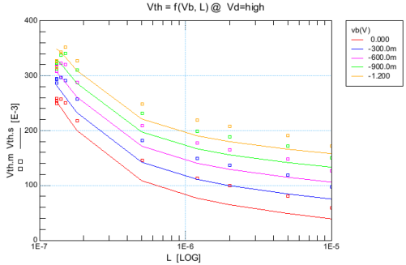

As shown in <a href="#fig-vth_vs_l" class="quarto-xref">Figure 11</a>,
it is worth notting that the threshold voltage in saturation is strongly
dependent on the gate length \[5\]. From
<a href="#fig-vth_vs_l" class="quarto-xref">Figure 11</a>, we see that
the threshold voltage for a long-channel transistor with
*V**S**B* = 0 is as low as *V**T*0 ≅ 50 *m**V*. It
then increases to about *V**T*0 ≅ 250 *m**V* for a
short-channel transistor. This threshold voltage change (about 200 mV)
can have an important impact on the bias voltages, such as the voltages
generated by the bias circuit shown in
<a href="#fig-cascode_with_bias" class="quarto-xref">Figure 10</a>.

## Design procedure

### Sizing of M1

M1 is biased in weak inversion in order to maximize the
current efficiency and is sized according to the specification on the
GBW and the load capacitance according to The gate transconductance of
M1 *G**m*1 in deep weak inversion is given by The
bias current *I**b* must satisfy the following inequality
which for the given specifications gives *I**b*, *m**i**n*=
198 *n**A*.

To have some margin to account for the additional parasitic capacitance
at the output that add to the load capacitance *C**L*, we set
*I**b*= 250 *n**A* and the inversion coefficient of
M1 to *I**C*1= 0.1. The transconductance can be
calculated from the *G**m*/*I**D* function as

$G\_{m1} = \frac{I_b}{n\_{0n}\\U_T} \cdot gmsid(IC_1) =$ 7.258
$\frac{\mu A}{V}$.

This leads to a gain-bandwidth product

$GBW = \frac{G\_{m1}}{2\pi\\C_L} =$ 1.2 *M**H**z*,

which is slightly higher than the target specification offering some
margin.

Knowing the drain current *I**D*1 and the inversion
coefficient, we can calculate the *W*/*L* aspect ratio for M1
as

$\frac{W_1}{L_1} = \frac{I_b}{I\_{spec\Box n}\\IC_1} =$ 3.5.

To choose the length of M1, we can split the gain equally
between the driver transistor
*A**v*1 = *G**m*1/*G**d**s*1 and the
cascode transistor
*A**v*2 = *G**m**s*2/*G**d**s*2. This
leads to *A**v*1 = *A**v*2= 10 giving the desired
overall gain of *A**d**c*= 40 dB. We can then deduce the
transistor length and width as

*L*1= 250 *n**m* and

*W*1= 880 *n**m*.

Before sizing M2 we need to size M5.

### Sizing the bias circuit

Since we need to bias M2, M4 and M5 in
weak inversion we need to make sure that that M2 and
M4 remain in weak inversion despite they are much wider than
M5 and biased with the same current *I**b*. For
this reason we start sizing M5 first. Since we know the drain
current of M5, if we choose its inversion coefficient we get
the *W*/*L*. Let’s choose *I**C*5= 0.1 for which we get
*W*/*L*= 3.530. As mentioned above, we need to be careful choosing the
length of M5 because of the strong dependence of the
threshold voltage to the transistor length. Since the bias circuit is
based on the assumption that all the transistors have the same threshold
voltage, it is safer to choose the same length for all transistors. We
can choose *L*1 since we already have chosen it. Therefore
*L*7 = *L*6 = *L*5 = *L*4 = *L*3 = *L*2 = *L*1=
250 *n**m*. This leads to *W*5= 880 *n**m* and
*L*5= 250 *n**m*.

Note that choosing *L*2 = *L*1 leads to
*G**d**s*2 ≅ *G**d**s*1 since M1 and
M2 carry the same current. The DC gain of the cascode
transistor *G**m**s*2/*G**d**s*2 should be
slightly larger than the DC gain of the driver transistor
*G**m*1/*G**d**s*1= 10, because
*G**m**s*2 \> *G**m*1. The DC gain should
therefore be achieved.

Since M7 carries twice the current of M1, if we
want M7 to have the same inversion coefficient than
M1, we need to choose *W*7 = 2 *W*1=
1.76 *μ**m*. The width of M6 needs to be 5 times larger than
*W*7 leading to *W*6= 5 *W*7= 8.80
*μ**m*.

Finally M3 is taken identical to M1 resulting in
*W*3 = *W*1= 0.88 *μ**m* and *L*3= 250
*n**m*.

### Sizing of M2

We can now finalize the design by sizing M2. In order to save
voltage headroom we need to bias M2 in weak inversion. This
is done by choosing *W*2 to be 5 times *W*5,
leading to *W*2= 4.40 *μ**m* with *L*2= 250
*n**m*. With these dimensions, the inversion coefficient of
M2 is 5 times smaller than that of M5,
*I**C*2= 0.020, which is making sure that M2 is
biased in weak inversion. We can now check the DC gain. The source
transconductance and output conductance of M2 are equal to
*G**m**s*2= 9.479 *μ**A*/*V* and *G**d**s*2=
727.273 *n**A*/*V*. This leads to a cascode voltage gain of
*A**v*2= 13.03 and an overall gain *A**d**c*=
42.30 *d**B* which, as expected, is slightly higher than the specs.

The sizing procedure is now finished and is summarized in the next
section.

## Summary

### Specifications

The specifications are recalled in
<a href="#tbl-cascode_specs2" class="quarto-xref">Table 5</a>.

<table class="do-not-create-environment cell">
<thead>
<tr>
<th style="text-align: left;">Specification</th>
<th style="text-align: center;">Symbol</th>
<th style="text-align: center;">Value</th>
<th style="text-align: center;">Unit</th>
</tr>
</thead>
<tbody>
<tr>
<td style="text-align: left;">Minimum DC gain</td>
<td style="text-align: center;"><em>A</em><em>d</em><em>c</em></td>
<td style="text-align: center;">40</td>
<td style="text-align: center;"><em>d</em><em>B</em></td>
</tr>
<tr>
<td style="text-align: left;">Minimum gain-bandwidth product</td>
<td style="text-align: center;"><em>G</em><em>B</em><em>W</em></td>
<td style="text-align: center;">1</td>
<td style="text-align: center;"><em>M</em><em>H</em><em>z</em></td>
</tr>
<tr>
<td style="text-align: left;">Load capacitance</td>
<td style="text-align: center;"><em>C</em><em>L</em></td>
<td style="text-align: center;">1</td>
<td style="text-align: center;"><em>p</em><em>F</em></td>
</tr>
</tbody>
</table>

### Bias

The bias information are summarized in
<a href="#tbl-cascode_bias" class="quarto-xref">Table 6</a>.

<table class="do-not-create-environment cell">
<thead>
<tr>
<th style="text-align: left;">Bias voltage or current</th>
<th style="text-align: center;">Symbol</th>
<th style="text-align: center;">Value</th>
<th style="text-align: center;">Unit</th>
</tr>
</thead>
<tbody>
<tr>
<td style="text-align: left;">Supply voltage</td>
<td style="text-align: center;"><em>V</em><em>D</em><em>D</em></td>
<td style="text-align: center;">1.2</td>
<td style="text-align: center;"><em>V</em></td>
</tr>
<tr>
<td style="text-align: left;">Bias current</td>
<td style="text-align: center;"><em>I</em><em>b</em></td>
<td style="text-align: center;">250</td>
<td style="text-align: center;"><em>n</em><em>A</em></td>
</tr>
</tbody>
</table>

### Transistor information

The transistor sizes and bias information are summarized in
<a href="#tbl-transistor_info_size" class="quarto-xref">Table 7</a> and
<a href="#tbl-transistor_info_bias" class="quarto-xref">Table 8</a>,
respectivily.
<a href="#tbl-transistor_info_ss" class="quarto-xref">Table 9</a> gives
the small-signal and thermal noise parameters. An Excel table is
generated with more information (e.g. all the parasitic capacitances).

<table class="do-not-create-environment cell">
<thead>
<tr>
<th style="text-align: center;">Transistor</th>
<th style="text-align: center;"><em>W</em> [<em>μ</em><em>m</em>]</th>
<th style="text-align: center;"><em>L</em> [<em>μ</em><em>m</em>]</th>
<th style="text-align: center;"><em>W</em><em>e</em><em>f</em><em>f</em> [<em>μ</em><em>m</em>]</th>
<th style="text-align: center;"><em>L</em><em>e</em><em>f</em><em>f</em> [<em>μ</em><em>m</em>]</th>
<th style="text-align: center;"><em>W</em>/<em>L</em></th>
<th style="text-align: center;"><em>A</em><em>D</em> [<em>μ</em><em>m</em>2]</th>
<th style="text-align: center;"><em>P</em><em>D</em> [<em>μ</em><em>m</em>]</th>
</tr>
</thead>
<tbody>
<tr>
<td style="text-align: center;">M1</td>
<td style="text-align: center;">0.88</td>
<td style="text-align: center;">0.25</td>
<td style="text-align: center;">0.900</td>
<td style="text-align: center;">0.191</td>
<td style="text-align: center;">4.708</td>
<td style="text-align: center;">0.299</td>
<td style="text-align: center;">2.440</td>
</tr>
<tr>
<td style="text-align: center;">M2</td>
<td style="text-align: center;">4.40</td>
<td style="text-align: center;">0.25</td>
<td style="text-align: center;">4.420</td>
<td style="text-align: center;">0.191</td>
<td style="text-align: center;">23.123</td>
<td style="text-align: center;">1.496</td>
<td style="text-align: center;">9.480</td>
</tr>
<tr>
<td style="text-align: center;">M3</td>
<td style="text-align: center;">0.88</td>
<td style="text-align: center;">0.25</td>
<td style="text-align: center;">0.900</td>
<td style="text-align: center;">0.191</td>
<td style="text-align: center;">4.708</td>
<td style="text-align: center;">0.299</td>
<td style="text-align: center;">2.440</td>
</tr>
<tr>
<td style="text-align: center;">M4</td>
<td style="text-align: center;">4.40</td>
<td style="text-align: center;">0.25</td>
<td style="text-align: center;">4.420</td>
<td style="text-align: center;">0.191</td>
<td style="text-align: center;">23.123</td>
<td style="text-align: center;">1.496</td>
<td style="text-align: center;">9.480</td>
</tr>
<tr>
<td style="text-align: center;">M5</td>
<td style="text-align: center;">0.88</td>
<td style="text-align: center;">0.25</td>
<td style="text-align: center;">0.900</td>
<td style="text-align: center;">0.191</td>
<td style="text-align: center;">4.708</td>
<td style="text-align: center;">0.299</td>
<td style="text-align: center;">2.440</td>
</tr>
<tr>
<td style="text-align: center;">M6</td>
<td style="text-align: center;">8.80</td>
<td style="text-align: center;">0.25</td>
<td style="text-align: center;">8.820</td>
<td style="text-align: center;">0.191</td>
<td style="text-align: center;">46.141</td>
<td style="text-align: center;">2.992</td>
<td style="text-align: center;">18.280</td>
</tr>
<tr>
<td style="text-align: center;">M7</td>
<td style="text-align: center;">1.76</td>
<td style="text-align: center;">0.25</td>
<td style="text-align: center;">1.780</td>
<td style="text-align: center;">0.191</td>
<td style="text-align: center;">9.312</td>
<td style="text-align: center;">0.598</td>
<td style="text-align: center;">4.200</td>
</tr>
</tbody>
</table>

<table class="do-not-create-environment cell">
<thead>
<tr>
<th style="text-align: center;">Transistor</th>
<th style="text-align: center;"><em>I</em><em>D</em> [<em>n</em><em>A</em>]</th>
<th style="text-align: center;"><em>I</em><em>s</em><em>p</em><em>e</em><em>c</em> [<em>n</em><em>A</em>]</th>
<th style="text-align: center;"><em>I</em><em>C</em></th>
<th style="text-align: center;"><em>V</em><em>P</em> − <em>V</em><em>S</em> [<em>m</em><em>V</em>]</th>
<th style="text-align: center;"><em>V</em><em>G</em> − <em>V</em><em>T</em>0 [<em>m</em><em>V</em>]</th>
<th style="text-align: center;"><em>V</em><em>D</em><em>S</em><em>s</em><em>a</em><em>t</em> [<em>m</em><em>V</em>]</th>
</tr>
</thead>
<tbody>
<tr>
<td style="text-align: center;">M1</td>
<td style="text-align: center;">250</td>
<td style="text-align: center;">3335</td>
<td style="text-align: center;">0.075</td>
<td style="text-align: center;">-65</td>
<td style="text-align: center;">-53</td>
<td style="text-align: center;">104</td>
</tr>
<tr>
<td style="text-align: center;">M2</td>
<td style="text-align: center;">250</td>
<td style="text-align: center;">16378</td>
<td style="text-align: center;">0.015</td>
<td style="text-align: center;">-108</td>
<td style="text-align: center;">-88</td>
<td style="text-align: center;">104</td>
</tr>
<tr>
<td style="text-align: center;">M3</td>
<td style="text-align: center;">250</td>
<td style="text-align: center;">3335</td>
<td style="text-align: center;">0.075</td>
<td style="text-align: center;">-65</td>
<td style="text-align: center;">-53</td>
<td style="text-align: center;">104</td>
</tr>
<tr>
<td style="text-align: center;">M4</td>
<td style="text-align: center;">250</td>
<td style="text-align: center;">16378</td>
<td style="text-align: center;">0.015</td>
<td style="text-align: center;">-108</td>
<td style="text-align: center;">-88</td>
<td style="text-align: center;">104</td>
</tr>
<tr>
<td style="text-align: center;">M5</td>
<td style="text-align: center;">250</td>
<td style="text-align: center;">3335</td>
<td style="text-align: center;">0.075</td>
<td style="text-align: center;">-65</td>
<td style="text-align: center;">-53</td>
<td style="text-align: center;">104</td>
</tr>
<tr>
<td style="text-align: center;">M6</td>
<td style="text-align: center;">250</td>
<td style="text-align: center;">32682</td>
<td style="text-align: center;">0.008</td>
<td style="text-align: center;">-126</td>
<td style="text-align: center;">-103</td>
<td style="text-align: center;">104</td>
</tr>
<tr>
<td style="text-align: center;">M7</td>
<td style="text-align: center;">500</td>
<td style="text-align: center;">6596</td>
<td style="text-align: center;">0.076</td>
<td style="text-align: center;">-65</td>
<td style="text-align: center;">-53</td>
<td style="text-align: center;">104</td>
</tr>
</tbody>
</table>

<table class="do-not-create-environment cell">
<thead>
<tr>
<th style="text-align: center;">Transistor</th>
<th style="text-align: center;"><em>G</em><em>s</em><em>p</em><em>e</em><em>c</em> [<em>μ</em><em>A</em>/<em>V</em>]</th>
<th style="text-align: center;"><em>G</em><em>m</em><em>s</em> [<em>μ</em><em>A</em>/<em>V</em>]</th>
<th style="text-align: center;"><em>G</em><em>m</em> [<em>μ</em><em>A</em>/<em>V</em>]</th>
<th style="text-align: center;"><em>G</em><em>d</em><em>s</em> [<em>n</em><em>A</em>/<em>V</em>]</th>
<th style="text-align: center;"><em>γ</em><em>n</em></th>
</tr>
</thead>
<tbody>
<tr>
<td style="text-align: center;">M1</td>
<td style="text-align: center;">128.933</td>
<td style="text-align: center;">9.033</td>
<td style="text-align: center;">7.404</td>
<td style="text-align: center;">727.273</td>
<td style="text-align: center;">0.623</td>
</tr>
<tr>
<td style="text-align: center;">M2</td>
<td style="text-align: center;">633.206</td>
<td style="text-align: center;">9.522</td>
<td style="text-align: center;">7.805</td>
<td style="text-align: center;">727.273</td>
<td style="text-align: center;">0.613</td>
</tr>
<tr>
<td style="text-align: center;">M3</td>
<td style="text-align: center;">128.933</td>
<td style="text-align: center;">9.033</td>
<td style="text-align: center;">7.404</td>
<td style="text-align: center;">727.273</td>
<td style="text-align: center;">0.623</td>
</tr>
<tr>
<td style="text-align: center;">M4</td>
<td style="text-align: center;">633.206</td>
<td style="text-align: center;">9.522</td>
<td style="text-align: center;">7.805</td>
<td style="text-align: center;">727.273</td>
<td style="text-align: center;">0.613</td>
</tr>
<tr>
<td style="text-align: center;">M5</td>
<td style="text-align: center;">128.933</td>
<td style="text-align: center;">9.033</td>
<td style="text-align: center;">7.404</td>
<td style="text-align: center;">727.273</td>
<td style="text-align: center;">0.623</td>
</tr>
<tr>
<td style="text-align: center;">M6</td>
<td style="text-align: center;">1263.547</td>
<td style="text-align: center;">9.593</td>
<td style="text-align: center;">7.863</td>
<td style="text-align: center;">727.273</td>
<td style="text-align: center;">0.612</td>
</tr>
<tr>
<td style="text-align: center;">M7</td>
<td style="text-align: center;">255.002</td>
<td style="text-align: center;">18.053</td>
<td style="text-align: center;">14.798</td>
<td style="text-align: center;">1454.545</td>
<td style="text-align: center;">0.623</td>
</tr>
</tbody>
</table>

# Theoretical estimations

We can now check the transfer function and the input-referred noise PSD.

## Transfer function

The parameters that are required to evaluate the transfer function are
calculated in
<a href="#tbl-cascode_gain" class="quarto-xref">Table 10</a>.

<table class="do-not-create-environment cell">
<thead>
<tr>
<th style="text-align: center;">Symbol</th>
<th style="text-align: center;">Theoretical Value</th>
<th style="text-align: center;">Unit</th>
</tr>
</thead>
<tbody>
<tr>
<td style="text-align: center;"><em>A</em><em>d</em><em>c</em></td>
<td style="text-align: center;">43</td>
<td style="text-align: center;"><em>d</em><em>B</em></td>
</tr>
<tr>
<td style="text-align: center;"><em>G</em><em>m</em>1</td>
<td style="text-align: center;">7.404</td>
<td style="text-align: center;"><em>μ</em><em>A</em>/<em>V</em></td>
</tr>
<tr>
<td style="text-align: center;"><em>G</em><em>m</em><em>s</em>2</td>
<td style="text-align: center;">9.522</td>
<td style="text-align: center;"><em>μ</em><em>A</em>/<em>V</em></td>
</tr>
<tr>
<td style="text-align: center;"><em>f</em><em>c</em></td>
<td style="text-align: center;">7.669</td>
<td style="text-align: center;"><em>k</em><em>H</em><em>z</em></td>
</tr>
<tr>
<td style="text-align: center;"><em>G</em><em>B</em><em>W</em></td>
<td style="text-align: center;">1.1</td>
<td style="text-align: center;"><em>M</em><em>H</em><em>z</em></td>
</tr>
</tbody>
</table>

Using the values given in
<a href="#tbl-cascode_gain" class="quarto-xref">Table 10</a>, we can now
plot the transfer function which is plotted in
<a href="#fig-cascode_tf_the" class="quarto-xref">Figure 12</a>.

## Input-referred noise

We can now compute all the parameters needed for the calculation of the
OTA thermal noise excess factor and its input-referred thermal noise
resistance. They are given in
<a href="#tbl-thermal" class="quarto-xref">Table 11</a>.

> **Warning**
>
> In order to check the effect of the cascode on the noise, we will
> ignore the noise contribution of the bias circuit. Of course in
> reality the bias circuit will also contribute to the output noise.

<table class="do-not-create-environment cell">
<thead>
<tr>
<th style="text-align: center;">Symbol</th>
<th style="text-align: center;">Theoretical Value</th>
<th style="text-align: center;">Unit</th>
</tr>
</thead>
<tbody>
<tr>
<td style="text-align: center;"><em>G</em><em>m</em>1</td>
<td style="text-align: center;">7.404</td>
<td style="text-align: center;"><em>μ</em><em>A</em>/<em>V</em></td>
</tr>
<tr>
<td style="text-align: center;"><em>G</em><em>m</em><em>s</em>2</td>
<td style="text-align: center;">9.522</td>
<td style="text-align: center;"><em>μ</em><em>A</em>/<em>V</em></td>
</tr>
<tr>
<td style="text-align: center;"><em>G</em><em>d</em><em>s</em>1</td>
<td style="text-align: center;">0.727</td>
<td style="text-align: center;"><em>μ</em><em>A</em>/<em>V</em></td>
</tr>
<tr>
<td style="text-align: center;"><em>G</em><em>m</em>1 <em>G</em><em>m</em><em>s</em>2/<em>G</em><em>d</em><em>s</em>12</td>
<td style="text-align: center;">133.295</td>
<td style="text-align: center;">-</td>
</tr>
<tr>
<td style="text-align: center;"><em>γ</em><em>n</em>1</td>
<td style="text-align: center;">0.623</td>
<td style="text-align: center;">-</td>
</tr>
<tr>
<td style="text-align: center;"><em>δ</em><em>n</em>2</td>
<td style="text-align: center;">0.502</td>
<td style="text-align: center;">-</td>
</tr>
<tr>
<td style="text-align: center;"><em>η</em><em>t</em><em>h</em></td>
<td style="text-align: center;">0.006048</td>
<td style="text-align: center;">-</td>
</tr>
<tr>
<td style="text-align: center;"><em>R</em><em>n</em><em>t</em></td>
<td style="text-align: center;">84.696</td>
<td style="text-align: center;"><em>k</em><em>Ω</em></td>
</tr>
<tr>
<td style="text-align: center;"><em>γ</em><em>c</em><em>a</em><em>s</em></td>
<td style="text-align: center;">0.627</td>
<td style="text-align: center;">-</td>
</tr>
<tr>
<td style="text-align: center;">$\sqrt{S_{ninth}}$</td>
<td style="text-align: center;">37.469</td>
<td style="text-align: center;">$nV/\sqrt{Hz}$</td>
</tr>
<tr>
<td style="text-align: center;">10 ⋅ log (<em>S</em><em>n</em><em>i</em><em>n</em><em>t</em><em>h</em>)</td>
<td style="text-align: center;">-148.527</td>
<td style="text-align: center;">$dBv/\sqrt{Hz}$</td>
</tr>
</tbody>
</table>

<table class="do-not-create-environment cell">
<thead>
<tr>
<th style="text-align: center;">Symbol</th>
<th style="text-align: center;">Theoretical Value</th>
<th style="text-align: center;">Unit</th>
</tr>
</thead>
<tbody>
<tr>
<td style="text-align: center;">(<em>n</em>2 <em>G</em><em>m</em>1/<em>G</em><em>d</em><em>s</em>1)2</td>
<td style="text-align: center;">154.3</td>
<td style="text-align: center;">-</td>
</tr>
<tr>
<td style="text-align: center;">$\frac{{W_1
\cdot L_1}}{{W_2 \cdot L_2}}$</td>
<td style="text-align: center;">0.2</td>
<td style="text-align: center;">-</td>
</tr>
<tr>
<td style="text-align: center;"><em>η</em><em>f</em><em>l</em></td>
<td style="text-align: center;">0.001</td>
<td style="text-align: center;">-</td>
</tr>
<tr>
<td style="text-align: center;">$\sqrt{{S_{{ninfl}}(1\,Hz)}}$</td>
<td style="text-align: center;">28.9</td>
<td style="text-align: center;">$\mu
V/\sqrt{{Hz}}$</td>
</tr>
<tr>
<td style="text-align: center;">10 ⋅ log (<em>S</em><em>n</em><em>i</em><em>n</em><em>f</em><em>l</em>(1 <em>H</em><em>z</em>))</td>
<td style="text-align: center;">-90.8</td>
<td style="text-align: center;">$dBv/\sqrt{{Hz}}$</td>
</tr>
<tr>
<td style="text-align: center;"><em>f</em><em>k</em></td>
<td style="text-align: center;">929</td>
<td style="text-align: center;"><em>k</em><em>H</em><em>z</em></td>
</tr>
</tbody>
</table>

We can plot the input-referred noise PSD which is shown in
<a href="#fig-cascode_noise_the" class="quarto-xref">Figure 13</a>.

# Validation by simulation

The above design can be verified using ngspice simulations. We will use
the circuit shown in
<a href="#fig-cascode_sim_schematic" class="quarto-xref">Figure 14</a>
to run the simulations. Note that the bias voltage *V**b*1 is
generated by the additonal current branch with M3 and
M4. In this way we ensure that the DC gate voltage of
M1 actually corresponds to its drain current. The bias
voltage *V**b*2 is generated by transistors M5,
M6 and M7.

> **Note**
>
> The simulations are performed with the PSP 103.6 compact model \[6\].
> For ngspice, we use the Verilog-A implementation given in the IHP
> package \[4\] and compiled the OSDI file with OpneVAF \[7\] to run
> with ngspice \[8\]. In addition to the PSP user manual \[6\] a
> documentation of PSP and other MOSFET compact models and their
> parameter extraction can be found in \[9\].

We start checking the transistors operating point in the next section.

## Operating point

Before running the AC and NOISE simulations, we first need to check the
quiescent voltages and currents and the operating points of all
transistors by running an .OP simulation. The node voltages are
extracted from the .ic file and presented in
<a href="#tbl-ng_node_voltages" class="quarto-xref">Table 13</a>. The
transistor drain current and voltages are presented in
<a href="#tbl-ng_op1" class="quarto-xref">Table 14</a>. The small-signal
parameters are given in
<a href="#tbl-ng_op2" class="quarto-xref">Table 15</a> and the noise PSD
are given in <a href="#tbl-ng_op3" class="quarto-xref">Table 16</a>.

<table class="do-not-create-environment cell">
<thead>
<tr>
<th style="text-align: center;">Node</th>
<th style="text-align: center;">Voltage</th>
</tr>
</thead>
<tbody>
<tr>
<td style="text-align: center;">vdd</td>
<td style="text-align: center;">1.2</td>
</tr>
<tr>
<td style="text-align: center;">in</td>
<td style="text-align: center;">0.302368</td>
</tr>
<tr>
<td style="text-align: center;">out</td>
<td style="text-align: center;">0.302368</td>
</tr>
<tr>
<td style="text-align: center;">vb1</td>
<td style="text-align: center;">0.302368</td>
</tr>
<tr>
<td style="text-align: center;">vb2</td>
<td style="text-align: center;">0.409582</td>
</tr>
<tr>
<td style="text-align: center;">1</td>
<td style="text-align: center;">0.159909</td>
</tr>
<tr>
<td style="text-align: center;">2</td>
<td style="text-align: center;">0.159909</td>
</tr>
<tr>
<td style="text-align: center;">3</td>
<td style="text-align: center;">0.302368</td>
</tr>
<tr>
<td style="text-align: center;">4</td>
<td style="text-align: center;">0.103188</td>
</tr>
<tr>
<td style="text-align: center;">5</td>
<td style="text-align: center;">0.302163</td>
</tr>
</tbody>
</table>

<table class="do-not-create-environment cell">
<thead>
<tr>
<th style="text-align: center;">Transistor</th>
<th style="text-align: center;"><em>I</em><em>D</em> [<em>n</em><em>A</em>]</th>
<th style="text-align: center;"><em>V</em><em>G</em><em>S</em> [<em>m</em><em>V</em>]</th>
<th style="text-align: center;"><em>V</em><em>D</em><em>S</em> [<em>m</em><em>V</em>]</th>
<th style="text-align: center;"><em>V</em><em>S</em><em>B</em> [<em>m</em><em>V</em>]</th>
<th style="text-align: center;"><em>V</em><em>G</em><em>S</em> − <em>V</em><em>T</em> [<em>m</em><em>V</em>]</th>
<th style="text-align: center;"><em>V</em><em>D</em><em>s</em><em>a</em><em>t</em> [<em>m</em><em>V</em>]</th>
</tr>
</thead>
<tbody>
<tr>
<td style="text-align: center;">M1</td>
<td style="text-align: center;">250</td>
<td style="text-align: center;">302</td>
<td style="text-align: center;">160</td>
<td style="text-align: center;">0</td>
<td style="text-align: center;">-49</td>
<td style="text-align: center;">116</td>
</tr>
<tr>
<td style="text-align: center;">M2</td>
<td style="text-align: center;">250</td>
<td style="text-align: center;">250</td>
<td style="text-align: center;">142</td>
<td style="text-align: center;">160</td>
<td style="text-align: center;">-104</td>
<td style="text-align: center;">115</td>
</tr>
<tr>
<td style="text-align: center;">M3</td>
<td style="text-align: center;">250</td>
<td style="text-align: center;">302</td>
<td style="text-align: center;">160</td>
<td style="text-align: center;">0</td>
<td style="text-align: center;">-49</td>
<td style="text-align: center;">116</td>
</tr>
<tr>
<td style="text-align: center;">M4</td>
<td style="text-align: center;">250</td>
<td style="text-align: center;">250</td>
<td style="text-align: center;">142</td>
<td style="text-align: center;">160</td>
<td style="text-align: center;">-104</td>
<td style="text-align: center;">115</td>
</tr>
<tr>
<td style="text-align: center;">M5</td>
<td style="text-align: center;">250</td>
<td style="text-align: center;">306</td>
<td style="text-align: center;">306</td>
<td style="text-align: center;">103</td>
<td style="text-align: center;">-58</td>
<td style="text-align: center;">116</td>
</tr>
<tr>
<td style="text-align: center;">M6</td>
<td style="text-align: center;">250</td>
<td style="text-align: center;">199</td>
<td style="text-align: center;">199</td>
<td style="text-align: center;">103</td>
<td style="text-align: center;">-131</td>
<td style="text-align: center;">114</td>
</tr>
<tr>
<td style="text-align: center;">M7</td>
<td style="text-align: center;">500</td>
<td style="text-align: center;">302</td>
<td style="text-align: center;">103</td>
<td style="text-align: center;">0</td>
<td style="text-align: center;">-47</td>
<td style="text-align: center;">117</td>
</tr>
</tbody>
</table>

<table class="do-not-create-environment cell">
<thead>
<tr>
<th style="text-align: center;">Transistor</th>
<th style="text-align: center;"><em>G</em><em>m</em> [<em>μ</em><em>A</em>/<em>V</em>]</th>
<th style="text-align: center;"><em>G</em><em>m</em><em>b</em> [<em>μ</em><em>A</em>/<em>V</em>]</th>
<th style="text-align: center;"><em>G</em><em>d</em><em>s</em> [<em>n</em><em>A</em>/<em>V</em>]</th>
</tr>
</thead>
<tbody>
<tr>
<td style="text-align: center;">M1</td>
<td style="text-align: center;">6.729</td>
<td style="text-align: center;">0.971</td>
<td style="text-align: center;">520.208</td>
</tr>
<tr>
<td style="text-align: center;">M2</td>
<td style="text-align: center;">7.408</td>
<td style="text-align: center;">0.954</td>
<td style="text-align: center;">638.083</td>
</tr>
<tr>
<td style="text-align: center;">M3</td>
<td style="text-align: center;">6.729</td>
<td style="text-align: center;">0.971</td>
<td style="text-align: center;">520.208</td>
</tr>
<tr>
<td style="text-align: center;">M4</td>
<td style="text-align: center;">7.408</td>
<td style="text-align: center;">0.954</td>
<td style="text-align: center;">638.083</td>
</tr>
<tr>
<td style="text-align: center;">M5</td>
<td style="text-align: center;">6.823</td>
<td style="text-align: center;">0.899</td>
<td style="text-align: center;">429.712</td>
</tr>
<tr>
<td style="text-align: center;">M6</td>
<td style="text-align: center;">7.501</td>
<td style="text-align: center;">0.959</td>
<td style="text-align: center;">536.693</td>
</tr>
<tr>
<td style="text-align: center;">M7</td>
<td style="text-align: center;">13.424</td>
<td style="text-align: center;">1.933</td>
<td style="text-align: center;">1418.369</td>
</tr>
</tbody>
</table>

<table class="do-not-create-environment cell">
<thead>
<tr>
<th style="text-align: center;">Transistor</th>
<th style="text-align: center;"><em>S</em><em>I</em><em>D</em>, <em>t</em><em>h</em> [<em>A</em>2/<em>H</em><em>z</em>]</th>
<th style="text-align: center;"><em>S</em><em>I</em><em>D</em>, <em>f</em><em>l</em>
at 1Hz [<em>A</em>2/<em>H</em><em>z</em>]</th>
</tr>
</thead>
<tbody>
<tr>
<td style="text-align: center;">M1</td>
<td style="text-align: center;">7.304e-26</td>
<td style="text-align: center;">2.778e-20</td>
</tr>
<tr>
<td style="text-align: center;">M2</td>
<td style="text-align: center;">7.676e-26</td>
<td style="text-align: center;">6.483e-21</td>
</tr>
<tr>
<td style="text-align: center;">M3</td>
<td style="text-align: center;">7.304e-26</td>
<td style="text-align: center;">2.778e-20</td>
</tr>
<tr>
<td style="text-align: center;">M4</td>
<td style="text-align: center;">7.676e-26</td>
<td style="text-align: center;">6.483e-21</td>
</tr>
<tr>
<td style="text-align: center;">M5</td>
<td style="text-align: center;">7.179e-26</td>
<td style="text-align: center;">2.233e-20</td>
</tr>
<tr>
<td style="text-align: center;">M6</td>
<td style="text-align: center;">7.523e-26</td>
<td style="text-align: center;">2.993e-21</td>
</tr>
<tr>
<td style="text-align: center;">M7</td>
<td style="text-align: center;">1.549e-25</td>
<td style="text-align: center;">6.015e-20</td>
</tr>
</tbody>
</table>

<table class="do-not-create-environment cell">
<thead>
<tr>
<th style="text-align: center;">Transistor</th>
<th style="text-align: center;"><em>W</em><em>e</em><em>f</em><em>f</em> [<em>μ</em><em>m</em>]</th>
<th style="text-align: center;"><em>L</em><em>e</em><em>f</em><em>f</em> [<em>μ</em><em>m</em>]</th>
<th style="text-align: center;"><em>W</em><em>e</em><em>f</em><em>f</em>/<em>L</em><em>e</em><em>f</em><em>f</em></th>
<th style="text-align: center;"><em>I</em><em>s</em><em>p</em><em>e</em><em>c</em> [<em>μ</em><em>A</em>]</th>
<th style="text-align: center;"><em>I</em><em>C</em></th>
</tr>
</thead>
<tbody>
<tr>
<td style="text-align: center;">M1</td>
<td style="text-align: center;">0.900</td>
<td style="text-align: center;">0.191</td>
<td style="text-align: center;">4.708</td>
<td style="text-align: center;">3.335</td>
<td style="text-align: center;">0.075</td>
</tr>
<tr>
<td style="text-align: center;">M2</td>
<td style="text-align: center;">4.420</td>
<td style="text-align: center;">0.191</td>
<td style="text-align: center;">23.123</td>
<td style="text-align: center;">16.378</td>
<td style="text-align: center;">0.015</td>
</tr>
<tr>
<td style="text-align: center;">M3</td>
<td style="text-align: center;">0.900</td>
<td style="text-align: center;">0.191</td>
<td style="text-align: center;">4.708</td>
<td style="text-align: center;">3.335</td>
<td style="text-align: center;">0.075</td>
</tr>
<tr>
<td style="text-align: center;">M4</td>
<td style="text-align: center;">4.420</td>
<td style="text-align: center;">0.191</td>
<td style="text-align: center;">23.123</td>
<td style="text-align: center;">16.378</td>
<td style="text-align: center;">0.015</td>
</tr>
<tr>
<td style="text-align: center;">M5</td>
<td style="text-align: center;">0.900</td>
<td style="text-align: center;">0.191</td>
<td style="text-align: center;">4.708</td>
<td style="text-align: center;">3.335</td>
<td style="text-align: center;">0.075</td>
</tr>
<tr>
<td style="text-align: center;">M6</td>
<td style="text-align: center;">8.820</td>
<td style="text-align: center;">0.191</td>
<td style="text-align: center;">46.141</td>
<td style="text-align: center;">32.682</td>
<td style="text-align: center;">0.008</td>
</tr>
<tr>
<td style="text-align: center;">M7</td>
<td style="text-align: center;">1.780</td>
<td style="text-align: center;">0.191</td>
<td style="text-align: center;">9.312</td>
<td style="text-align: center;">6.596</td>
<td style="text-align: center;">0.076</td>
</tr>
</tbody>
</table>

<table class="do-not-create-environment cell">
<thead>
<tr>
<th style="text-align: center;">Transistor</th>
<th style="text-align: center;"><em>G</em><em>s</em><em>p</em><em>e</em><em>c</em> [<em>μ</em><em>A</em>/<em>V</em>]</th>
<th style="text-align: center;"><em>n</em></th>
<th style="text-align: center;"><em>G</em><em>m</em> [<em>μ</em><em>A</em>/<em>V</em>]</th>
<th style="text-align: center;"><em>G</em><em>m</em><em>s</em> [<em>μ</em><em>A</em>/<em>V</em>]</th>
<th style="text-align: center;"><em>G</em><em>d</em><em>s</em> [<em>n</em><em>A</em>/<em>V</em>]</th>
</tr>
</thead>
<tbody>
<tr>
<td style="text-align: center;">M1</td>
<td style="text-align: center;">128.933</td>
<td style="text-align: center;">1.144</td>
<td style="text-align: center;">6.729</td>
<td style="text-align: center;">7.700</td>
<td style="text-align: center;">520.208</td>
</tr>
<tr>
<td style="text-align: center;">M2</td>
<td style="text-align: center;">633.206</td>
<td style="text-align: center;">1.129</td>
<td style="text-align: center;">7.408</td>
<td style="text-align: center;">8.362</td>
<td style="text-align: center;">638.083</td>
</tr>
<tr>
<td style="text-align: center;">M3</td>
<td style="text-align: center;">128.933</td>
<td style="text-align: center;">1.144</td>
<td style="text-align: center;">6.729</td>
<td style="text-align: center;">7.700</td>
<td style="text-align: center;">520.208</td>
</tr>
<tr>
<td style="text-align: center;">M4</td>
<td style="text-align: center;">633.206</td>
<td style="text-align: center;">1.129</td>
<td style="text-align: center;">7.408</td>
<td style="text-align: center;">8.362</td>
<td style="text-align: center;">638.083</td>
</tr>
<tr>
<td style="text-align: center;">M5</td>
<td style="text-align: center;">128.933</td>
<td style="text-align: center;">1.132</td>
<td style="text-align: center;">6.823</td>
<td style="text-align: center;">7.721</td>
<td style="text-align: center;">429.712</td>
</tr>
<tr>
<td style="text-align: center;">M6</td>
<td style="text-align: center;">1263.547</td>
<td style="text-align: center;">1.128</td>
<td style="text-align: center;">7.501</td>
<td style="text-align: center;">8.460</td>
<td style="text-align: center;">536.693</td>
</tr>
<tr>
<td style="text-align: center;">M7</td>
<td style="text-align: center;">255.002</td>
<td style="text-align: center;">1.144</td>
<td style="text-align: center;">13.424</td>
<td style="text-align: center;">15.357</td>
<td style="text-align: center;">1418.369</td>
</tr>
</tbody>
</table>

<table class="do-not-create-environment cell">
<thead>
<tr>
<th style="text-align: center;">Transistor</th>
<th style="text-align: center;">$\sqrt{S_{nin,th}}\;[nV/\sqrt{Hz}]$</th>
<th style="text-align: center;"><em>R</em><em>n</em><em>i</em><em>n</em>, <em>t</em><em>h</em> [<em>k</em><em>Ω</em>]</th>
<th style="text-align: center;"><em>γ</em><em>n</em> [−]</th>
<th style="text-align: center;">$\sqrt{S_{nin,fl}}\;[nV/\sqrt{Hz}]$</th>
</tr>
</thead>
<tbody>
<tr>
<td style="text-align: center;">M1</td>
<td style="text-align: center;">40.166</td>
<td style="text-align: center;">97.329</td>
<td style="text-align: center;">0.655</td>
<td style="text-align: center;">24768.869</td>
</tr>
<tr>
<td style="text-align: center;">M2</td>
<td style="text-align: center;">37.398</td>
<td style="text-align: center;">84.377</td>
<td style="text-align: center;">0.625</td>
<td style="text-align: center;">10868.814</td>
</tr>
<tr>
<td style="text-align: center;">M3</td>
<td style="text-align: center;">40.166</td>
<td style="text-align: center;">97.329</td>
<td style="text-align: center;">0.655</td>
<td style="text-align: center;">24768.870</td>
</tr>
<tr>
<td style="text-align: center;">M4</td>
<td style="text-align: center;">37.398</td>
<td style="text-align: center;">84.377</td>
<td style="text-align: center;">0.625</td>
<td style="text-align: center;">10868.820</td>
</tr>
<tr>
<td style="text-align: center;">M5</td>
<td style="text-align: center;">39.272</td>
<td style="text-align: center;">93.045</td>
<td style="text-align: center;">0.635</td>
<td style="text-align: center;">21900.429</td>
</tr>
<tr>
<td style="text-align: center;">M6</td>
<td style="text-align: center;">36.567</td>
<td style="text-align: center;">80.665</td>
<td style="text-align: center;">0.605</td>
<td style="text-align: center;">7294.033</td>
</tr>
<tr>
<td style="text-align: center;">M7</td>
<td style="text-align: center;">29.319</td>
<td style="text-align: center;">51.860</td>
<td style="text-align: center;">0.696</td>
<td style="text-align: center;">18270.585</td>
</tr>
</tbody>
</table>

<table class="do-not-create-environment cell">
<thead>
<tr>
<th style="text-align: center;">Trans.</th>
<th style="text-align: center;">Type</th>
<th style="text-align: center;"><em>V</em><em>G</em> [<em>V</em>]</th>
<th style="text-align: center;"><em>V</em><em>S</em> [<em>V</em>]</th>
<th style="text-align: center;"><em>V</em><em>D</em> [<em>V</em>]</th>
<th style="text-align: center;"><em>V</em><em>D</em><em>S</em> [<em>m</em><em>V</em>]</th>
<th style="text-align: center;"><em>V</em><em>D</em><em>S</em><em>s</em><em>a</em><em>t</em> [<em>m</em><em>V</em>]</th>
<th style="text-align: center;">Reg.</th>
<th style="text-align: center;">Sat.</th>
</tr>
</thead>
<tbody>
<tr>
<td style="text-align: center;">M1</td>
<td style="text-align: center;">n</td>
<td style="text-align: center;">0.302</td>
<td style="text-align: center;">0.000</td>
<td style="text-align: center;">0.160</td>
<td style="text-align: center;">160</td>
<td style="text-align: center;">116</td>
<td style="text-align: center;">WI</td>
<td style="text-align: center;">sat</td>
</tr>
<tr>
<td style="text-align: center;">M2</td>
<td style="text-align: center;">n</td>
<td style="text-align: center;">0.410</td>
<td style="text-align: center;">0.160</td>
<td style="text-align: center;">0.302</td>
<td style="text-align: center;">142</td>
<td style="text-align: center;">115</td>
<td style="text-align: center;">WI</td>
<td style="text-align: center;">sat</td>
</tr>
<tr>
<td style="text-align: center;">M3</td>
<td style="text-align: center;">n</td>
<td style="text-align: center;">0.302</td>
<td style="text-align: center;">0.000</td>
<td style="text-align: center;">0.160</td>
<td style="text-align: center;">160</td>
<td style="text-align: center;">116</td>
<td style="text-align: center;">WI</td>
<td style="text-align: center;">sat</td>
</tr>
<tr>
<td style="text-align: center;">M4</td>
<td style="text-align: center;">n</td>
<td style="text-align: center;">0.410</td>
<td style="text-align: center;">0.160</td>
<td style="text-align: center;">0.302</td>
<td style="text-align: center;">142</td>
<td style="text-align: center;">115</td>
<td style="text-align: center;">WI</td>
<td style="text-align: center;">sat</td>
</tr>
<tr>
<td style="text-align: center;">M5</td>
<td style="text-align: center;">n</td>
<td style="text-align: center;">0.410</td>
<td style="text-align: center;">0.103</td>
<td style="text-align: center;">0.410</td>
<td style="text-align: center;">306</td>
<td style="text-align: center;">116</td>
<td style="text-align: center;">WI</td>
<td style="text-align: center;">sat</td>
</tr>
<tr>
<td style="text-align: center;">M6</td>
<td style="text-align: center;">n</td>
<td style="text-align: center;">0.302</td>
<td style="text-align: center;">0.103</td>
<td style="text-align: center;">0.302</td>
<td style="text-align: center;">199</td>
<td style="text-align: center;">114</td>
<td style="text-align: center;">WI</td>
<td style="text-align: center;">sat</td>
</tr>
<tr>
<td style="text-align: center;">M7</td>
<td style="text-align: center;">n</td>
<td style="text-align: center;">0.302</td>
<td style="text-align: center;">0.000</td>
<td style="text-align: center;">0.103</td>
<td style="text-align: center;">103</td>
<td style="text-align: center;">117</td>
<td style="text-align: center;">WI</td>
<td style="text-align: center;">lin</td>
</tr>
</tbody>
</table>

From <a href="#tbl-ng_node_voltages" class="quarto-xref">Table 13</a>,
we observe that the drain voltage of M1 (voltage at node 1)
is *V**D*1 = *V*(1)= 160 *m**V* which is sligtly larger than
4 *U**T*= 104 *m**V*. This comes from the fact that
transistor M5 is not biased deep in weak inversion but with
an inversion coefficient *I**C*5= 0.075 which makes its
*V**G**S* voltage larger moving the voltage at node 1 a bit
higher.

The *V**D**S* voltages of
<a href="#tbl-ng_op1" class="quarto-xref">Table 14</a> are all larger
than the *V**D**s**a**t* voltages, confirming that all the
transistors are biased in saturation. This is also confirmed in
<a href="#tbl-ng_bias" class="quarto-xref">Table 20</a>.

Comparing to the theoretical values of
<a href="#tbl-transistor_info_ss" class="quarto-xref">Table 9</a>, we
see that the simulated transconductance values are slightly smaller than
the theoretical values, while the simulated output conductances are
smaller than the theoretical values.

## Small-signal transfer function

After having checked the operating point and making sure that all
transistors are biased in saturation, we can now perform the AC
simulation. The simulation results are compared to the theoretical
estimations in
<a href="#fig-ng_transfer_function" class="quarto-xref">Figure 15</a>.
The simulated *G**B**W* is slightly smaller than the theoretical value
but remains on target. The simulated DC gain is larger than the
theoretical estimation.

## Output resistance

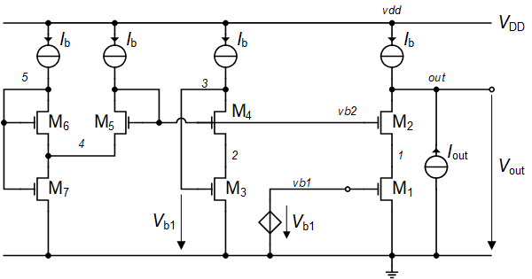

We can check that the cascode significantly reduces the output
conductance (increases the output resistance). In order to do this we
add an AC current source at the output with zero DC value as shown in
<a href="#fig-cascode_gout" class="quarto-xref">Figure 16</a>. This AC
current source will not change the oquiscent output voltage but will
inject a small-signal current at the ouput. Measuring the output voltage
we can then deduce the output admittance or impedance.

The result of the simulation is presented in
<a href="#fig-ng_output_resistance" class="quarto-xref">Figure 17</a>
where the simulated small-signal output impedance is plotted versus
frequency and compared to
*R**d**s*1 = 1/*G**d**s*1,
*R**d**s*2 = 1/*G**d**s*2 and the theoretical
expression The values of *G**m**s*2, *G**d**s*1
and *G**d**s*2 are extracted from PSP. We see a perfect match
between the simulation and theoretical value of *R**o**u**t*.

The output resistance is increased by a factor which is about
(*G**m**s*2 + *G**d**s*1 + *G**d**s*2)/*G**d**s*2=
14.9.

This demonstrates that adding a cascode transistor significantly
improves the output resistance at the cost of slightly less voltage
headroom. It is particularly usefull for this technology where the nMOS
transistor have a very low output resistance.

## Input-referred noise

We can now simulate the input-referred noise PSD and check whether the
noise of the cascode transistor M2 is indeed much lower than
the noise of the driver transistor M1. To avoid the noise
contribution of the biasing circuit, we set the bias voltages
*V**b*1 and *V**b*2 with two voltage sources
having the appropriate values extracted from the OP simulation, namely
*V**b*1= 302 *m**V* and *V**b*2= 410 *m**V*. The
input-referred noise PSD is plotted in
<a href="#fig-ng_noise" class="quarto-xref">Figure 18</a> and compared
to the theoretical estimation. We see that the simulated white noise is
reasonably close to the theoretical estimation, however the simulated
flicker noise is smaller than the theoretical estimation. This comes
from the fact that in PSP the gate-referred flicker noise is bias
dependent which is not the case in the sEKV model.

The contributions of M1 and M2 to the
input-referred white noise are shown in
<a href="#fig-ng_white_noise_contributions"
class="quarto-xref">Figure 19</a>. As expected, we can observe that the
contribution of the cascode transistor M2 is more than 20 dB
lower than that of M1.

<a href="#fig-ng_flicker_noise_contributions"
class="quarto-xref">Figure 20</a> shows that the contribution of
M2 to the input-referred flicker noise PSD. We can observe
that the contribution of M2 is also about 20 dB lower than
that of M1.

The breakdown of the contributions of M1 and M2 to
the total input-referred noise is summarized in
<a href="#fig-ng_noise_contributions" class="quarto-xref">Figure 21</a>
which shows again that the noise contribution of M2 is more
than 20 dB lower than that of M1.

# Conclusion

In this notebook, we have first analyzed the cascode gain stage showing
that the DC voltage gain is equivalent to a two-stage amplifier. We also
have shown that the output resistance is increased by the voltage gain
of the cascode transistor. In addition, the noise of the cascode
transistor is much lower than that of the driver transistor and can
usually be neglected. We then have designed the cascode gain stage for
achieving a certain DC gain and gain-bandwidth product for a given load
capacitance for the IHP SG13G2 130nm BiCMOS technology. A particular
attention was brought to the design of the bias circuit to make sure
that both transistors M1 and M2 are biased in weak
inversion and in saturation. The circuit was then simulated with ngspice
for the chosen IHP 130nm CMOS process taking advantage of the open
source PDK. The simulation results are usually quite close to the values
predicted by the theory. The simulations have also confirmed the main
features of the cascode gain stage, namely a high voltage gain, high
output resistance and low-noise. These features are achieved without
increase of the current consumption (except the bias circuit which is
needed anyway) thanks to the current reuse feature of the cascode stage.

# References

\[1\]
C. C. Enz and E. A. Vittoz,
*Charge-Based MOS Transistor Modeling - The EKV
Model for Low-Power and RF IC Design*, 1st ed. John Wiley,
2006.

\[2\]
C. Enz, F. Chicco, and A.
Pezzotta, “Nanoscale MOSFET Modeling: Part 1: The
Simplified EKV Model for the Design of Low-Power Analog
Circuits,” *IEEE Solid-State Circuits Magazine*, vol. 9, no. 3,
pp. 26–35, 2017.

\[3\]
C. Enz, F. Chicco, and A.
Pezzotta, “Nanoscale MOSFET Modeling: Part 2: Using
the Inversion Coefficient as the Primary Design Parameter,” *IEEE
Solid-State Circuits Magazine*, vol. 9, no. 4, pp. 73–81, 2017.

\[4\]
IHP, “IHP SG13G2 Open Source PDK.”
<https://github.com/IHP-GmbH/IHP-Open-PDK>, 2025.

\[5\]
IHP, “IHP SG13G2 DC CV NMOS LV
Documentation (Rev. 1.2).”
<a href="ihp-sg13g2/libs.doc/meas/MOS/doc/report_nmos_lv.pdf"
class="uri">ihp-sg13g2/libs.doc/meas/MOS/doc/report_nmos_lv.pdf</a>,
2023.

\[6\]
G.D.J. Smit, A.J. Scholten, D.B.M.
Klaassen, O. Rozeau, S. Martinie, T. Poiroux and J.C. Barbé,
“PSP 103.6 - The PSP model is a joint development
of CEA-Leti and NXP Semiconductors.”
<https://www.cea.fr/cea-tech/leti/pspsupport/Documents/psp103p6_summary.pdf>,
2017.

\[7\]
SemiMod GmbH, “Open VAF.”
<https://openvaf.semimod.de/docs/getting-started/introduction/>,
2025.

\[8\]
Dietmar Warning,
“Verilog-A Models for Circuit Simulation.”
<https://github.com/dwarning/VA-Models>, 2024.

\[9\]
Agilent Technologies, “IC-CAP
2008, Nonlinear Device Models - Volume 1.”
<https://people.ece.ubc.ca/robertor/Links_files/Files/ICCAP-2008-doc/pdf/icmdl.pdf>,
2008.
